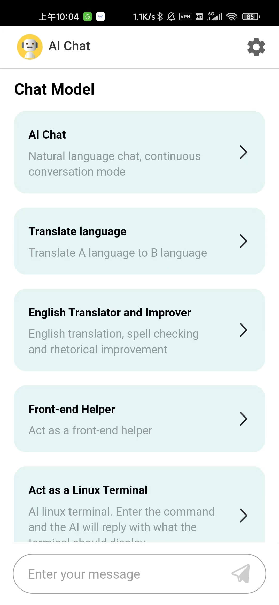
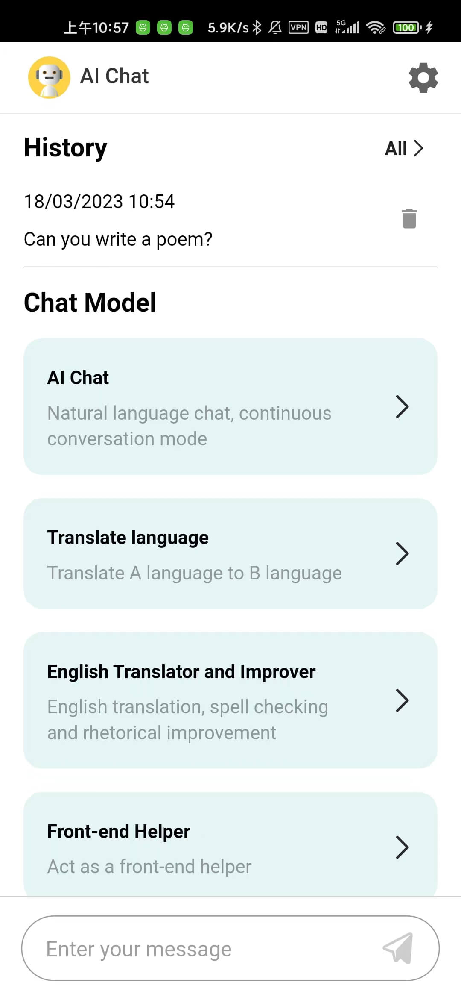
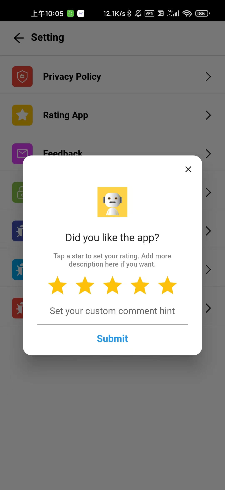
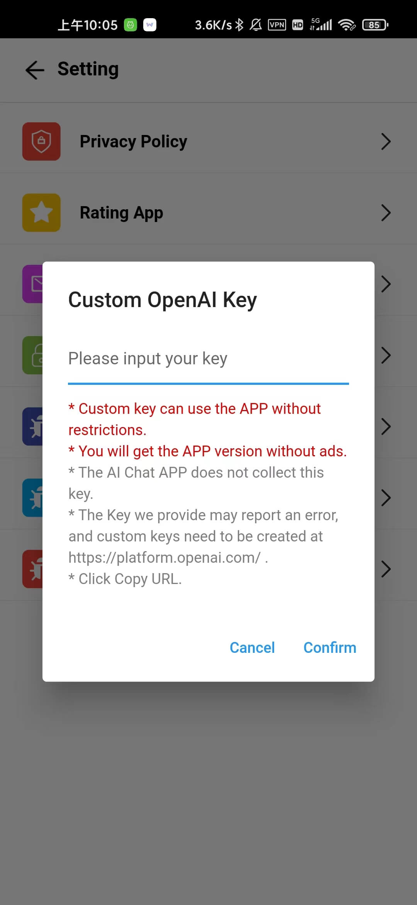
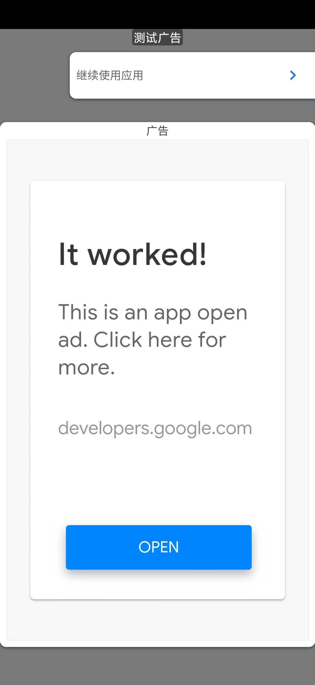
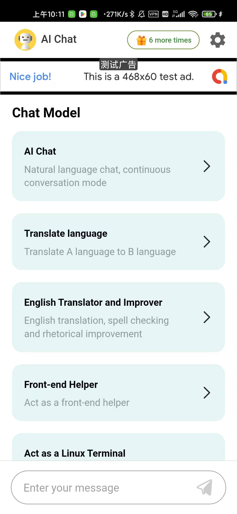
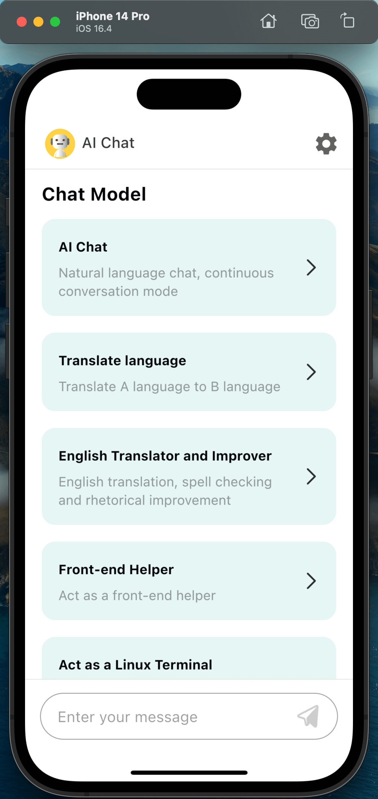

## ChatGPT Application with flutter

ChatGPT发布了4.0版本，但未完全开放，目前AI Chat使用`gpt-3.5-turbo`模型。

### 软件截图

#### 纯净版本(无广告)

<div align=left>

</div>

<div align=left>

</div>

<div align=left>

</div>

#### 广告版本

<div align=left>

</div>

<div align=left>

</div>

#### IOS模拟器运行

<div align=left>

</div>

### 软件版本

- 通过`lib/utils/Config.dart`中的`isInfiniteNumberVersion`配置是否无限次数版本

- main分支：无限次数版本，包含`chatgpt`，需要配置openaiKey。

- admob分支：看广告得次数的版本，包含`firebase`、`admob`、`chatgpt`，需要对应的广告配置和openaiKey。

目前安卓支持真机运行，IOS仅在模拟器上运行过，IOS打包需要开发者账号。

### 安装

#### `flutter`

- `3.*`版本，AI Chat编译时使用的是3.7.7版本.

#### `ChatGPT Token` （必要的）

- 将openai后台获取的token配置到`lib/utils/Chatgpt.dart`文件的`chatGptToken`变量中。

#### `admob` （广告版本）

- 对接了admob广告，main分支包含admob，需要在admob后台申请对应的广告ID，填写到`lib/utils/AdCommon.dart`文件。其中包括开屏广告、插页广告、插页激励广告和Banner广告。
- 将admob的`APPLICATION_ID`配置到`android/app/src/main/AndroidManifest.xml`

```
<meta-data android:name="com.google.android.gms.ads.APPLICATION_ID" android:value="****" />
```

- 同时将admob的`APPLICATION_ID`配置到`ios/Runner/Info.plist`

```
<key>GADApplicationIdentifier</key>
<string>****</string>
```

#### `firebase` （广告版本）

- 在firebase后台[https://console.firebase.google.com/](https://console.firebase.google.com/)配置安卓和IOS，安卓需要下载`google-services.json`，IOS需要下载`GoogleService-Info.plist`
- `google-services.json`: `android/app/google-services.json`
- `GoogleService-Info.plist`: `ios/Runner/GoogleService-Info.plist`

#### 安卓打包编译配置

- 打包编译需要先生成对应的密钥，这里自行去Google看打包步骤。

- 将生成的jks文件替换到`android/app/build_config/build.jks`

> 编辑`android/app/build.gradle`文件中的打包配置`signingConfigs`，并替换对应文件路径和密码等。

```
signingConfigs {
    release {
        storeFile file("./build_config/build.jks")
        storePassword "123456"
        keyAlias "appKey"
        keyPassword "123456"
    }
}
```

